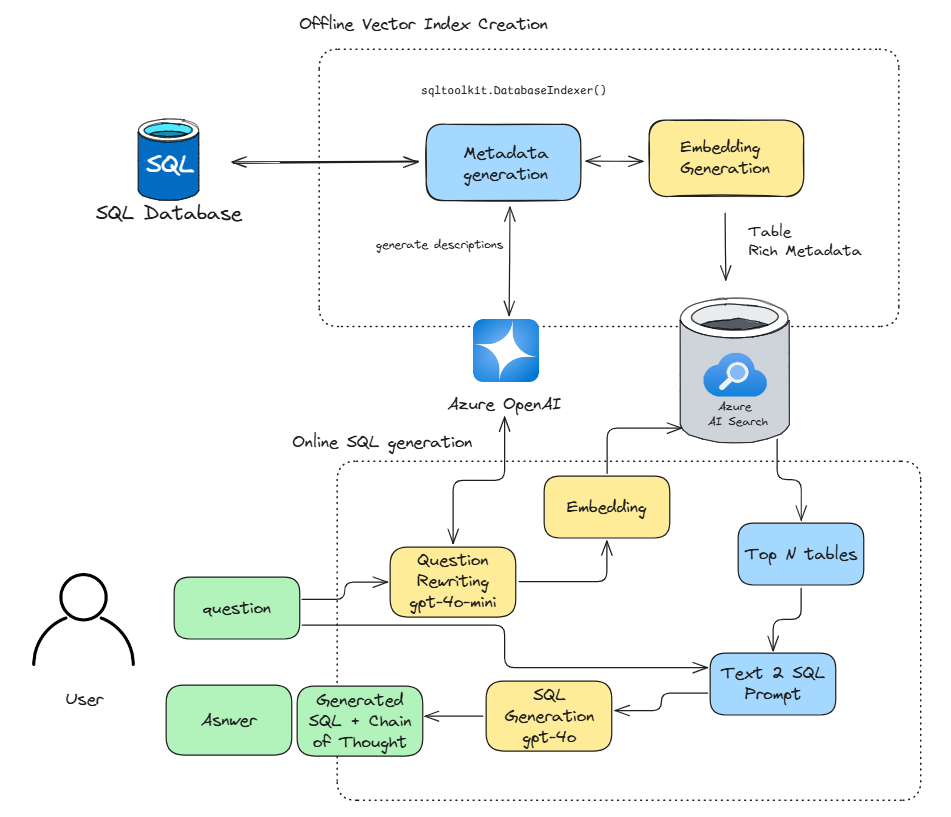

# azure-nl2sql-accelerator
Accelerator to interact with database in natural language using Azure OpenAI models.

This repository demonstrates a robust implementation of NL2SQL that injects rich table metadata into the LLM prompt through RAG to help improve SQL query generation.

This approach is different from traditional Agentic approaches that rely on just-in-time database exploration to generate SQL queries.

The process consists of two parts:
- **Offline**: Generate rich metadata about the database tables (column names, description, sample values, column type etc) and store these in a vector database (Azure AI Search)
- **Online**: When a question is asked, only the metadata for the most relevant tables based on the question is retrieved from the vector store and fed to the LLM to improve query accuracy.




**This respository has 4 main components:**
- the `sqltoolkit` library has utilities for offline metadata generation from a database ([sqltoolkit](sqltoolkit))
- A backend app exposing API endpoints to index the data and generate SQL ([backend](backend))
- A Sample front end streamlit app for demo purposes ([frontend](frontend))
- Quickstart notebooks for interactive testing: 
    - [quickstart_azure_sql_.ipynb](./notebooks/quickstart_azure_sql_.ipynb)
    - [quickstart_postgres.ipynb](./notebooks/quickstart_postgres.ipynb)
    - [quickstart_snowflake.ipynb](./notebooks/quickstart_snowflake.ipynb)

## Pre-requisites
The repository currently supports Azure SQL and PostgreSQL connections, with more coming.

- An Azure OpenAI resource with a gpt-4o, gpt-4o-mini and text-embedding-3-small deployment
- An Azure AI Search resource
- the odbc drivers for the databases should be installed and set-up in the environment running the code

## Sqltoolkit
`sqltoolkit` is a Python library for interacting with SQL databases, providing tools for connecting to databases, executing queries, and indexing data for Azure AI Search.

### Features

- Connect to Azure SQL, PostgreSQL, and other ODBC-compatible databases.
- Execute SQL queries and retrieve results.
- Extract schema and sample data from database tables.
- Generate AI-based descriptions for tables and columns.
- Integrate with Azure AI Search.

### Installation

```sh
pip install -r requirements.txt
```

### Usage

#### Connecting to a Database

```python
from sqltoolkit.connectors import AzureSQLConnector, PostgreSQLConnector, SnowflakeConnector
from sqltoolkit.client import DatabaseClient

# Azure SQL Connection using entra ID
azure_connector = AzureSQLConnector(server='your_server', database='your_database')
sql_client = DatabaseClient(azure_connector)

# Azure SQL Connection using password
azure_connector = AzureSQLConnector(server='your_server', database='your_database', use_entra_id=False, user='your_user', password='your_password')
sql_client = DatabaseClient(azure_connector)

# PostgreSQL Connection
postgres_connector = PostgreSQLConnector(host='your_host', database='your_database', user='your_user', password='your_password')
sql_client = DatabaseClient(postgres_connector)

# SnowflakeSQL Connection
snowflake_connector = SnowflakeConnector(
    user='your_user', password='your_password', account='your_account',
    warehouse='your_warehouse', database='your_database', schema='your_schema'
)
sql_client = DatabaseClient(snowflake_connector)
```

#### Executing Queries

```python
# List database tables
tables = sql_client.list_database_tables()
print(tables)

# Execute a custom query
query_result = sql_client.query("SELECT * FROM your_table LIMIT 10")
print(query_result)
```

#### Indexing Data for Azure AI Search

```python
from sqltoolkit.indexer import DatabaseIndexer
from azure.identity import DefaultAzureCredential

# Initialize the indexer
indexer = DatabaseIndexer(client=sql_client, openai_client=openai_client, aoai_deployment='your_deployment', embedding="text-embedding-3-small")

# Fetch and describe tables
table_manifests = indexer.fetch_and_describe_tables()

# Generate table embeddings
indexer.generate_table_embeddings()

# Export JSON manifest
json_manifest = indexer.export_json_manifest()
with open('tables_manifest.json', 'w') as f:
    f.write(json_manifest)

# Create Azure AI Search index
indexer.create_azure_ai_search_index(
    search_endpoint='your_search_endpoint',
    search_credential='your_search_credential',
    index_name='your_index_name',
    openai_endpoint='your_openai_endpoint',
    openai_key='your_openai_key',
    embedding_deployment='your_embedding_deployment'
)

# Push data to Azure AI Search
indexer.push_to_ai_search()
```

### Modules

- `connectors.py`: Database connectors for Azure SQL, PostgreSQL, and ODBC-compatible databases.
- `client.py`: `DatabaseClient` class for executing queries and retrieving results.
- `entities.py`: `Table` and `TableColumn` classes for representing database table metadata.
- `indexer.py`: `DatabaseIndexer` class for indexing data and integrating with Azure AI Search.
- `sql_queries.py`: Predefined SQL queries for different database types.
- `prompts.py`: Prompts for generating AI-based descriptions for tables and columns.

## Backend
the backend is written in python fastapi.\
backend is currently designed to take in all the required information (such as Azure OpenAI Api Keys, Azure AI Search information) instead of loading it from env variables

#### getting started with backend

1. change the directory to backend and install all the requirements
    ```
      cd backend
      pip install -r requirements.txt
    ```
2. go to the app directory
    ```
        cd app
    ```
3. run the fastapi application in dev mode
    ```
        fastapi dev main.py
    ```
4. to see the api definition, open the browser and move to http://localhost:8000/docs

## Frontend
you can attach any frontend application to call the backend api\
on this repo, we will be using streamlit to render a simple single page app.

#### getting started with frontend

1. move to streamlit app directory
    ```
        cd frontend/streamlit
        pip install -r requiements.txt
    ```
2. run the streamlit app
    ```
        streamlit run main.py
    ```
